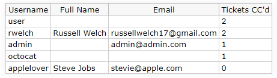

# UserOverview Trac Plugin

UserOverview is a Trac plugin that provides a macro to display all registered users and their CC activity in a convenient, easy-to-read table format. It aims to increase transparency and facilitate communication in project management.

## Table of Contents

- [UserOverview Trac Plugin](#useroverview-trac-plugin)
  - [Table of Contents](#table-of-contents)
  - [Features](#features)
  - [Installation](#installation)
  - [Usage](#usage)
  - [Contribution](#contribution)
  - [License](#license)

## Features

- Retrieves all registered users from the database.
- Displays detailed information for each user, including username, full name, email, and number of tickets CC'd.
- Sorts users by the number of tickets CC'd, with the most active users at the top.



## Installation

1. Clone the repository or download the ZIP file and extract it.
2. Open your terminal and navigate to the root directory (`UserOverview/`).
3. Run the command `python setup.py bdist_egg`. This will create a `.egg` file in a new `dist/` directory.
4. Copy the `.egg` file to your Trac environment's `plugins` directory.
5. Add the following line to the `[components]` section of your `trac.ini` file to enable your plugin:

```
[components]
user_overview.user_overview.UserOverviewMacro = enabled
```

6. Restart your Trac server.

## Usage

To use the UserOverview macro, simply add the following to any of your Trac wiki pages:

```
{{{#!UserOverview
}}}
```

The macro will be replaced by a table listing all registered users and their associated details.

## Contribution

Contributions are always welcome! Please read the [contribution guidelines](./CONTRIBUTING.md) first.

## License

[MIT](./LICENSE)
